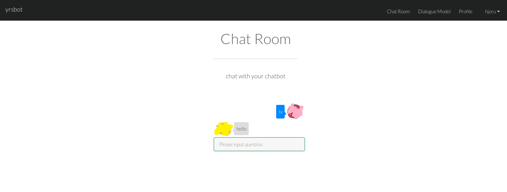

# Laravel + Chatbot
This project provide service which can customize chatbot. You can register account and upload your qa pair to customize your chatbot.

# Requirement
* apache 
* PHP >= 7.2
* npm
* mysql >= 14.14
* git

# Installation
## Ubuntu
fetch and upgrade packages
```
apt-get update && apt-get upgrade
```
install apache
```
apt-get install apache2
```
install system requirement
```
apt-get install php
apt-get install nodejs
apt-get install npm
apt-get install mysql-server
apt-get install git
```
create database in mysql and schema in database
```
create database chatbot;
source schema.sql
```
clone from git in apache root directory 
```
git clone https://github.com/hjoruhjoru/yrsbot.git
```
start apache
```
systemctl start apache2
```

# Screenshot



